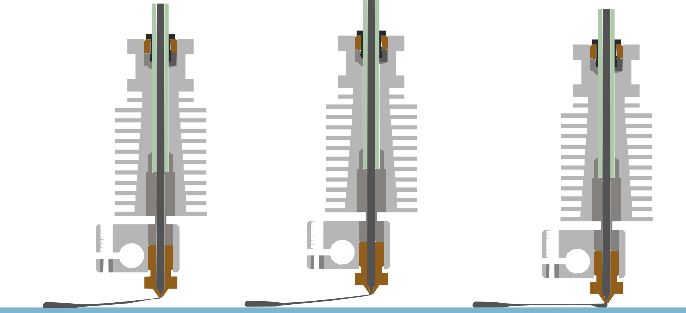
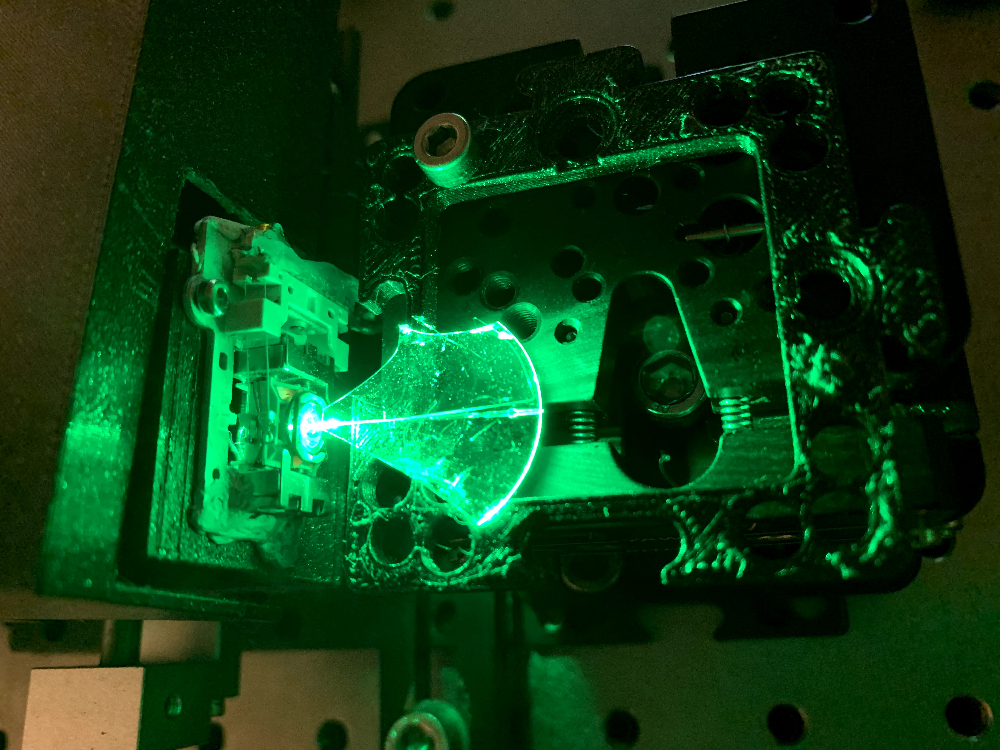
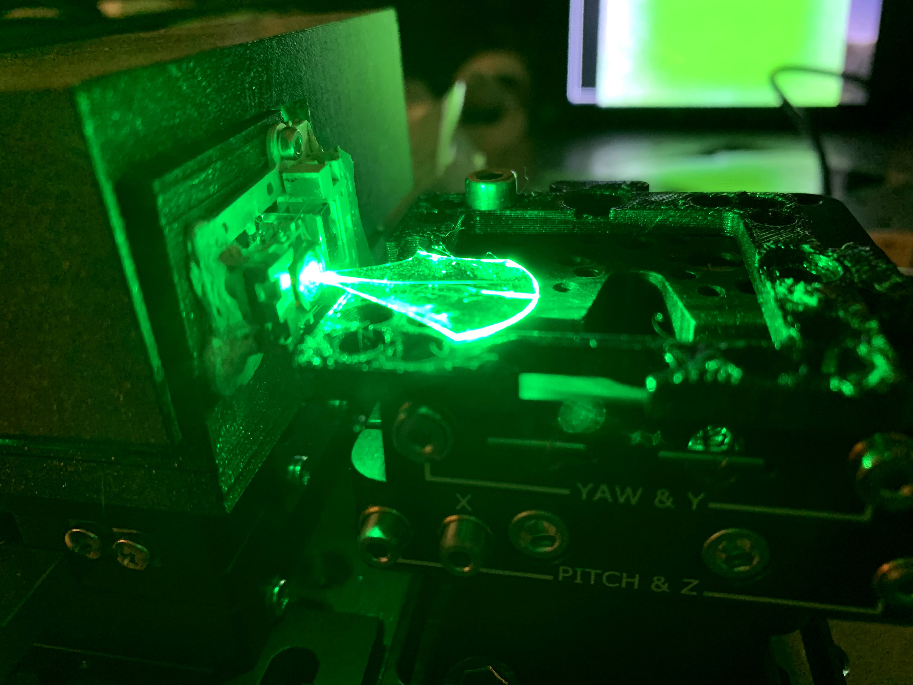
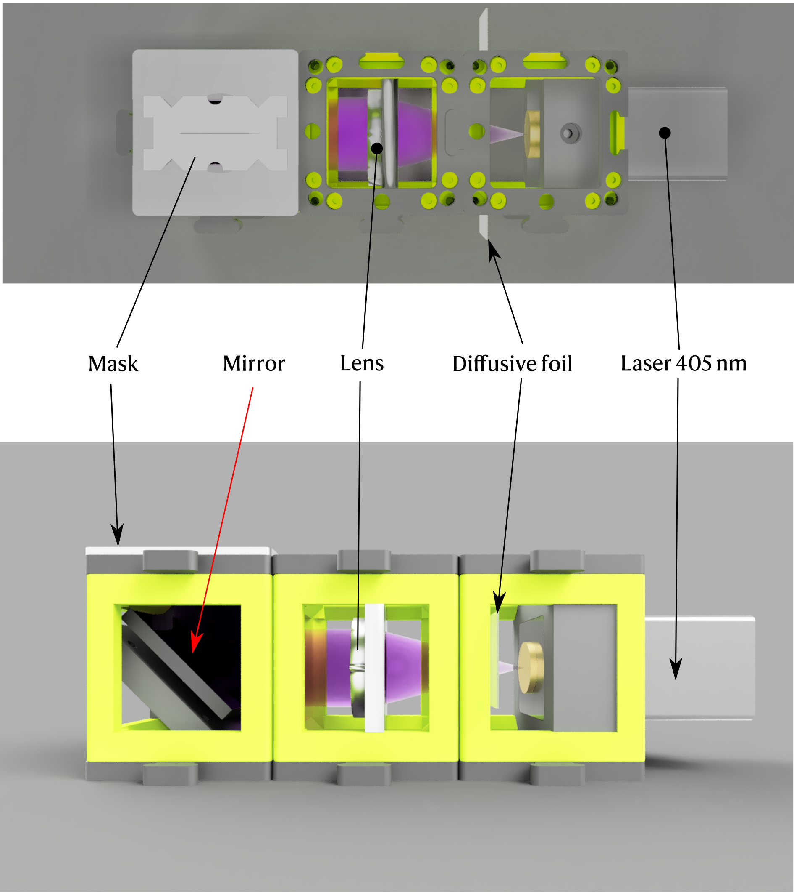

# UC2-waveguiding
_Jakub Dokulil, updated 2. September 2021_

This is repository for waveguide fabrication. The project aims to create waveguides for total internal reflection microscopy as cheap as couple of Euros are. 

Introduction
------------

Total Internal Reflection (TIR) microscopy ... _blah blah blah -- this is not so important right?_

Printing the waveguides with FDM printer
----------------------------------------



Goal was to pull the melted PETG from the hotend and create thread as thin as possible. The g-code you may find in the [FDM_waveguides](FDM_waveguides) folder.


The problem was, mainly with uneven and hardly controlable float of the filament. The created waveguides were later tested with weak signs of coupling. See following images

 

Spincoating approach
--------------------

The spincoating technique had been also chosen for the waveguide fabrication. 

__Loctite 3525__

The first photopolymer that had been tried, was loctite 3525.The recipe for the spincoating was adopted from [1] to create film as thin as possible. Therefore the recipe was following:

> 1. Rinse the coverslip with isopropanol, dry with preasured air.
> 2. Spin coat 5 s ramp 5 with 1 000 rpm, 30 s ramp 7 with 6 000 rpm.
> 3. Prebake on 60 °C for 2 min. This precedure helped to smoothen the surface as the surface hadn't been so nicely flat and smooth after spincoating.
> 4. Curing with knife cutted slits for 20 s full intensity.
> 5. Wash with acetone.

The created waveguides weren't good enough, so therefore the decision was met to use __MR DWL 5__.

__MR DWL 5__

The recipe for the second, more proffesional, photopolymer is following. The protocol have been created taking into account the producers documentation [2] (_needs to be found_).

> 1. Wash the coverslip (_Bene writes about the cleaning procedure_)
> 2. Spincoat for 30 s, ramp 7, 3 000 rpm
> 3. Prebake 90 °C for 4,5 min
> 4. 10 min wait
> 5. Cure with razorblade mask for 33 s (_now I'm not so sure about the time... sorry_). While curing move with the diffusive foil before the laser output.
> 6. Postbake on 90 °C for 4,5 min.
> 7. Wait 1 hour
> 8. Develop in Mr. DEV 5 for 90 s 
> 9. Hardbake for 20 min at 120 °C

The setup used for curing can be seen in the figure bellow. The intensity of beam passing throught the slit is 0,256 mW.




## Literature

[1] R. Delille, M. G. Urdaneta, S. J. Moseley and E. Smela, "Benchtop Polymer MEMS," in Journal of Microelectromechanical Systems, vol. 15, no. 5, pp. 1108-1120, Oct. 2006, doi: [10.1109/JMEMS.2006.882610](10.1109/JMEMS.2006.882610).

[2] -- to be refilled

### g-code for FDM


```
M73 P0 R1
M73 Q0 S1
M201 X1000 Y1000 Z200 E5000 ; sets maximum accelerations, mm/sec^2
M203 X200 Y200 Z12 E120 ; sets maximum feedrates, mm/sec
M204 P1250 R1250 T1250 ; sets acceleration (P, T) and retract acceleration (R), mm/sec^2
M205 X8.00 Y8.00 Z0.40 E4.50 ; sets the jerk limits, mm/sec
M205 S0 T0 ; sets the minimum extruding and travel feed rate, mm/sec
M107
M862.3 P "MK3S" ; printer model check
M862.1 P0.4 ; nozzle diameter check
G90 ; use absolute coordinates
M83 ; extruder relative mode
M104 S265 ; set extruder temp
M140 S80 ; set bed temx p
M109 S265 ; wait for extruder temp
M190 S80 ; wait for bed temp
M104 S250 ; set extruder temp
G28 W ; home all without mesh bed level
G80 ; mesh bed leveling
G1 Y-3.0 F1000.0 ; go outside print area
G92 E0.0
G1 X60.0 E5.0 F1000.0 ; intro line
M73 P10 R1
M73 Q10 S1
G1 X100.0 E12.5 F1000.0 ; intro line
G92 E0.0
M221 S95
; Don't change E values below. Excessive value can damage the printer.
M907 E430 ; set extruder motor current
G21 ; set units to millimeters
G90 ; use absolute coordinates
M83 ; use relative distances for extrusion
M900 K0.05 ; Filament gcode LA 1.5
M900 K30 ; Filament gcode LA 1.0
G1 E-0.80000 F2100.000
M73 Q17 S1
G1 Z0.400 F10800.000

; -------------------
G1 F8640.000
G1 X16 Y0.0 Z5.0
G1 X16 Y18.0 Z5.0 
; getting near to the coverslip
G1 X16 Y19.0 Z1.0
G1 F500.000
G1 X16 Y19.0 Z0.6 
G1 X16 Y20.0 Z0.6 E0.25
G4 P500
G1 X16 Y23.0 Z0.5 
G1 X16 Y24.0 Z0.5 
G1 F1100.000
G1 X16 Y27.0 Z0.7 ;new 
G1 X16 Y35.0 Z1.7 
G1 X16 Y39.0 Z0.8 
G1 X16 Y41.0 Z0.5 
G1 X16 Y43.0 Z0.5 E0.05
G4 P500
G1 F2000.000
G1 X16 Y58.0 Z0.5
G1 F2000.000
G1 X16 Y150.0 Z5.0
G1 F1500.000
G1 X16 Y170.0 Z3.0
G1 X16 Y180.0 Z2.0
G1 X16 Y190.0 Z0.1
G1 F500.000
G1 X16 Y193.0 Z0.1
G1 X16 Y193.0 Z40
G1 E-0.5
M104 S220 ; set extruder temp
```